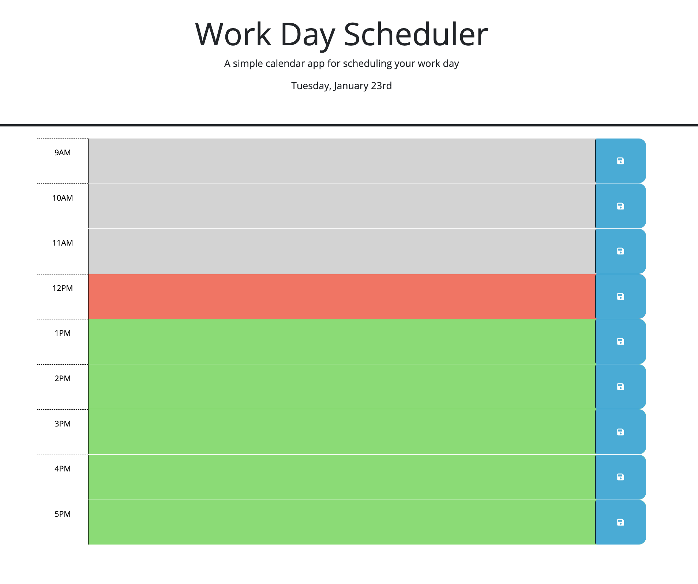

# rafa-daily-planner

## Description

The goal of this project is to provide a 9 to 5 daily planner. The planner saves event details into local storage and retrieves information whenever the webpage is reloaded. Events can be added to time-blocks from 9am to 5pm. The time-blocks are highlighted in specific colors to indicate past, present, and future events.

## Link to webpage

## Installation

N/A

## Usage

This is dayily event planner. It allows users to save daily events from 9am to 5pm. Users can simply type the event in the specific time-block and click the save button. To remove an event, clear the text and click the save button.

## Credits

N/A

## License

This project uses the MIT license.

## Badges

## Features

- Current date is displayed on top of the page.
- Type plans/events on specific time-blocks
- Events are saved to local storage, so data persists.
- The color of the time-block changes to reflect event times.
- Past events are highlighted in gray.  
- Present events are highlighted in red.  
- Future events are highlighted in green.  
